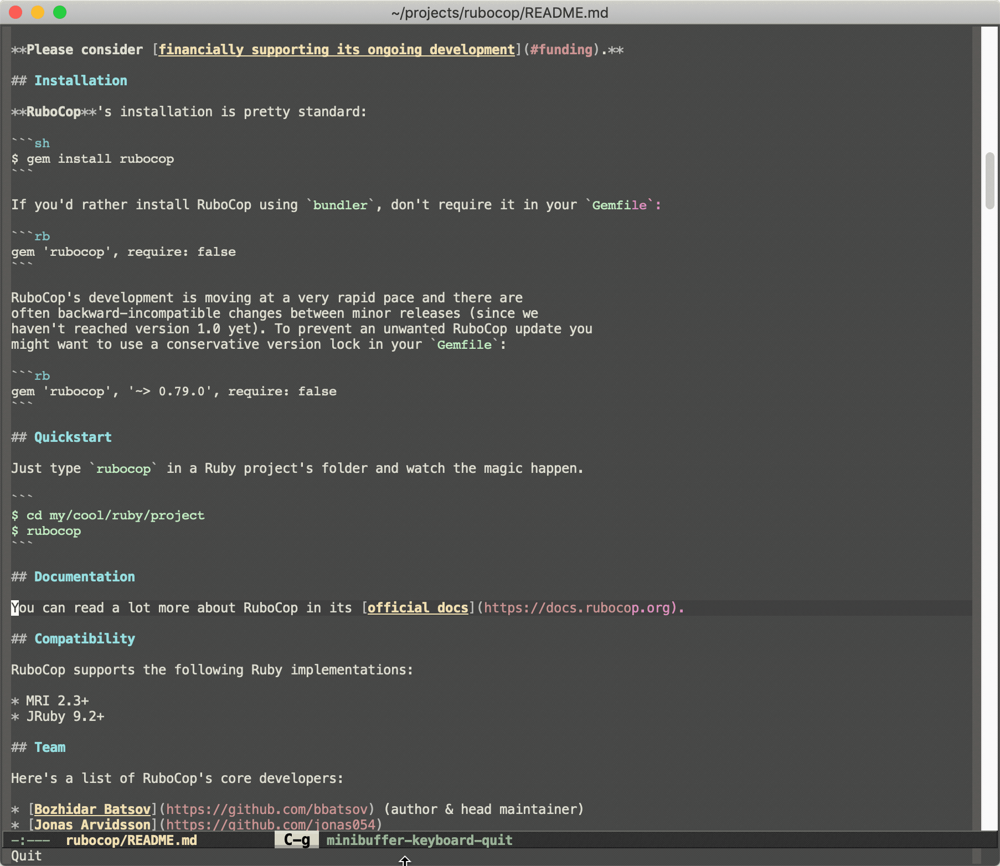

# Projectile

[](https://github.com/bbatsov/projectile/actions?query=workflow%3ACI)
[](http://melpa.org/#/projectile)
[](http://stable.melpa.org/#/projectile)
[](https://elpa.nongnu.org/nongnu/projectile.html)
[![License GPL 3][badge-license]](http://www.gnu.org/licenses/gpl-3.0.txt)

## Synopsis

**Projectile** is a project interaction library for Emacs. Its goal is to
provide a nice set of features operating on a project level without
introducing external dependencies (when feasible). For instance -
finding project files has a portable implementation written in pure
Emacs Lisp without the use of GNU `find` (but for performance sake an
indexing mechanism backed by external commands exists as well).

Projectile tries to be practical - portability is great, but if some
external tools could speed up some task substantially and the tools
are available, Projectile will leverage them.

This library provides easy project management and navigation. The concept of a
project is pretty basic - just a folder containing some special file (e.g. a VCS
marker or a project descriptor file like `pom.xml` or `Gemfile`). Projectile
will auto-detect pretty much every popular project type out of the box
and you can easily extend it with additional project types.

Here are some of Projectile's features:

* jump to a file in project
* jump to a project buffer
* jump to a test in project
* toggle between files with same names but different extensions (e.g. `.h` <-> `.c/.cpp`, `Gemfile` <-> `Gemfile.lock`)
* toggle between code and its test (e.g. `main.service.js` <-> `main.service.spec.js`)
* jump to recently visited files in the project
* switch between projects you have worked on
* kill (close) all project buffers
* grep (search) in project
* replace in project
* find references in project (using `xref` internally)
* run shell commands in a project (e.g. `make`, `lein`)
* support for multiple minibuffer completion/selection libraries (`ido`, `ivy`, `helm` and the default completion system)
* automatic project discovery (see `projectile-project-search-path`)
* integration with the built-in `project.el` library

There's also a rich ecosystem of third-party [Projectile extensions](https://melpa.org/#/?q=projectile) that add even more features.

---------------
[](https://www.patreon.com/bbatsov)
[](https://www.paypal.com/cgi-bin/webscr?cmd=_s-xclick&hosted_button_id=GRQKNBM6P8VRQ)

I've been developing Projectile for over a decade now (since 2011). While it's a fun
project to work on, it still requires a lot of time and energy to
maintain.

You can support my work on Projectile via
 [PayPal](https://www.paypal.me/bbatsov),
 [Patreon](https://www.patreon.com/bbatsov) and
 [GitHub Sponsors](https://github.com/sponsors/bbatsov).

## Projectile in Action

Here's a glimpse of Projectile in action (using `ivy`):



In this short demo you can see:

* finding files in a project
* switching between implementation and test
* switching between projects

## Quickstart

The instructions that follow are meant to get you from zero to a running Projectile setup
in a minute.  Visit the
[online documentation](https://docs.projectile.mx) for (way) more
details.

### Installation

`package.el` is the built-in package manager in Emacs.

Projectile is available on all major `package.el` community
maintained repos - [NonGNU ELPA](https://elpa.nongnu.org),
[MELPA Stable](http://stable.melpa.org)
and [MELPA](http://melpa.org).

You can install Projectile with the following command:

<kbd>M-x</kbd> `package-install` <kbd>[RET]</kbd> `projectile` <kbd>[RET]</kbd>

Alternatively, users of Debian 9 or later or Ubuntu 16.04 or later may
simply `apt-get install elpa-projectile`.

Finally add this to your Emacs config:

```elisp
(projectile-mode +1)
;; Recommended keymap prefix on macOS
(define-key projectile-mode-map (kbd "s-p") 'projectile-command-map)
;; Recommended keymap prefix on Windows/Linux
(define-key projectile-mode-map (kbd "C-c p") 'projectile-command-map)
```

Those keymap prefixes are just a suggestion. Feel free to put there whatever works best for you.

### Basic Usage

Enable `projectile-mode`, open a file in one of your projects and type a command such as <kbd>C-c p f</kbd>.

See the [online documentation](https://docs.projectile.mx) for more details.

To get the most of Projectile you also need to enable (and potentially install) some minibuffer completion framework (e.g. `ido`, `ivy` or `selectrum`). See [this section](https://docs.projectile.mx/projectile/configuration.html#completion-options) of the documentation for more details.

**Note:** Historically `projectile-completion-system` defaulted to `ido`, but this was changed in version 2.3. You may need to enable `ido-mode` in your Emacs configuration if updating from an older version of Projectile.

## Caveats

* Some operations like search (grep) depend (presently) on external
  utilities such as `find` or `fd` (version 8.3.0+).
  * for older `fd` version add `(setq projectile-generic-command "fd . -0 --type f --color=never")` to your init-file
* Commands depending on external utilities might misbehave on the `fish` shell.
* Using Projectile over TRAMP might be slow in certain cases.
* Some commands might misbehave on complex project setups (e.g. a git project with submodules).
* Projectile was mostly tested on Unix OS-es (e.g. GNU/Linux and macOS), so some functionality might not work well on Windows.

## Known issues

Check out the project's
[issue list](https://github.com/bbatsov/projectile/issues?sort=created&direction=desc&state=open)
a list of unresolved issues. By the way - feel free to fix any of them
and send me a pull request. :-)

## Contributors

Here's a [list](https://github.com/bbatsov/projectile/contributors) of all the people who have contributed to the
development of Projectile (a.k.a. Projectile's Hall of Fame).

Joining this esteemed group of people is only a commit away!

## Changelog

A fairly extensive changelog is available [here](CHANGELOG.md).

[badge-license]: https://img.shields.io/badge/license-GPL_3-green.svg

## License

Copyright © 2011-2022 Bozhidar Batsov and
[contributors](https://github.com/bbatsov/projectile/contributors).

Distributed under the GNU General Public License, version 3
