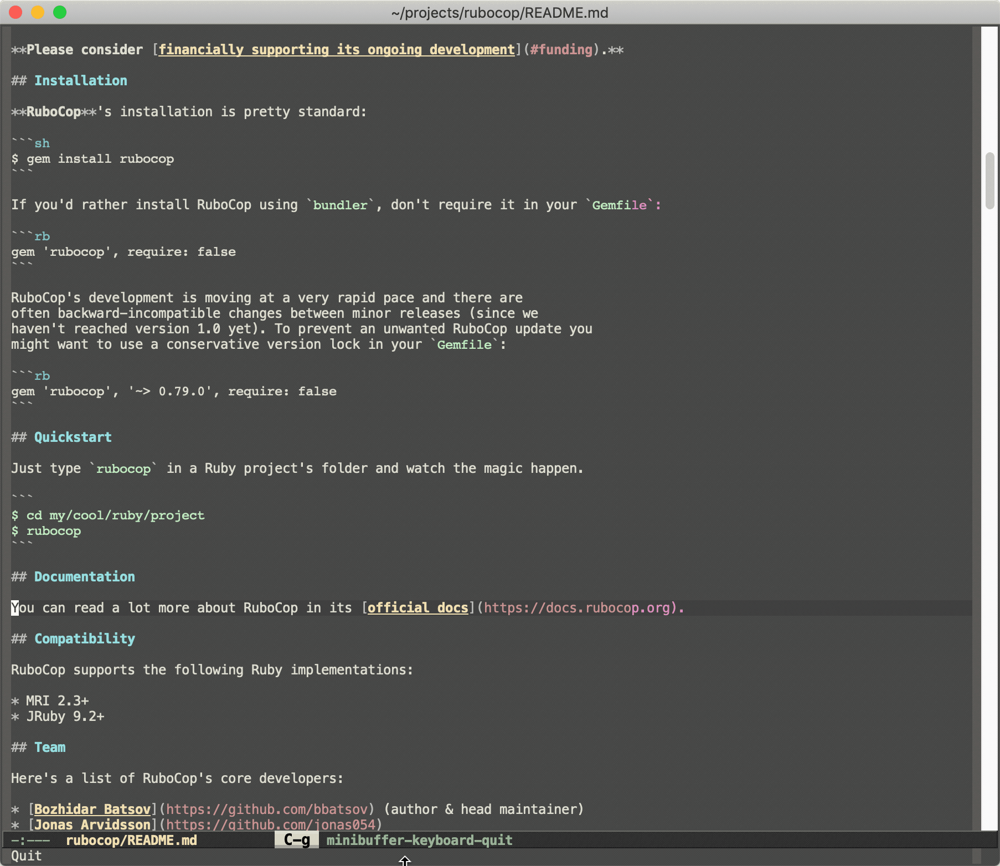

# Projectile

[](https://github.com/bbatsov/projectile/actions?query=workflow%3ACI)
[](http://melpa.org/#/projectile)
[](http://stable.melpa.org/#/projectile)
[](https://elpa.nongnu.org/nongnu/projectile.html)
[![License GPL 3][badge-license]](http://www.gnu.org/licenses/gpl-3.0.txt)
[](https://discord.gg/3Cf2Qpyry5)

## Synopsis

**Projectile** is a project interaction library for Emacs.
It provides a powerful set of features operating at the project
level, as well as simple heuristics to identify projects.

Here are some of Projectile's essential features:

* jump to a file in a project, [ranked by frecency](https://docs.projectile.mx/projectile/indexing.html#file-ranking-frecency) (how recently and often you visit it)
* jump to a project buffer
* jump to a test in a project
* [find a file of a given kind and jump between related files](https://docs.projectile.mx/projectile/projects.html#finding-files-by-kind) (e.g. a Rails model and its controller)
* toggle between files with the same name but different extensions (e.g. `.h` <-> `.c/.cpp`, `Gemfile` <-> `Gemfile.lock`)
* toggle between code and its test (e.g. `main.service.js` <-> `main.service.spec.js`)
* jump to recently visited files in the project
* switch between projects you have worked on
* [per-project sessions with tab-bar workspaces](https://docs.projectile.mx/projectile/sessions.html) (restore each project's window layout and buffers, even across restarts)
* kill (close) all project buffers
* [search a project](https://docs.projectile.mx/projectile/usage.html#reviewing-search-matches) (grep/ripgrep, plus a native reviewable results UI)
* [replace in a project](https://docs.projectile.mx/projectile/usage.html#reviewing-and-applying-replacements), with a reviewable before/after preview
* find references in a project (using `xref` internally)
* run [project commands and custom tasks](https://docs.projectile.mx/projectile/projects.html#project-tasks) (build/test/run, `make`, `lein`, and your own named tasks)
* [run the test at point](https://docs.projectile.mx/projectile/projects.html#running-the-test-at-point) (tree-sitter, Emacs 29+)
* works with any `completing-read`-based completion UI (Vertico, Consult, Fido, Ido, etc.)
* automatic project discovery (see `projectile-project-search-path`)
* integration with the built-in `project.el` library

There's also a rich ecosystem of third-party [Projectile extensions](https://melpa.org/#/?q=projectile) that add even more features.

---------------
[](https://www.patreon.com/bbatsov)
[](https://www.paypal.com/cgi-bin/webscr?cmd=_s-xclick&hosted_button_id=GRQKNBM6P8VRQ)

I've been developing Projectile for over a decade now (since 2011). While it's a fun
project to work on, it still requires a lot of time and energy to
maintain.

You can support my work on Projectile via
 [PayPal](https://www.paypal.me/bbatsov),
 [Patreon](https://www.patreon.com/bbatsov) and
 [GitHub Sponsors](https://github.com/sponsors/bbatsov).

## Projectile in Action

Here's a glimpse of Projectile in action (using `ivy`):



In this short demo you can see:

* finding files in a project
* switching between implementation and test
* switching between projects

## Quickstart

The instructions that follow are meant to get you from zero to a running Projectile setup
in a minute.  Visit the
[online documentation](https://docs.projectile.mx) for (way) more
details.

### Installation

`package.el` is the built-in package manager in Emacs.

Projectile is available on all major `package.el` community
maintained repos - [NonGNU ELPA](https://elpa.nongnu.org),
[MELPA Stable](http://stable.melpa.org)
and [MELPA](http://melpa.org).

You can install Projectile with the following command:

<kbd>M-x</kbd> `package-install` <kbd>[RET]</kbd> `projectile` <kbd>[RET]</kbd>

Alternatively, users of Debian 9 or later or Ubuntu 16.04 or later may
simply `apt-get install elpa-projectile`.

Finally add this to your Emacs config:

```elisp
(projectile-mode +1)
;; Recommended keymap prefix on macOS
(define-key projectile-mode-map (kbd "s-p") 'projectile-command-map)
;; Recommended keymap prefix on Windows/Linux
(define-key projectile-mode-map (kbd "C-c p") 'projectile-command-map)
```

Those keymap prefixes are just a suggestion. Feel free to put there whatever works best for you.

### Basic Usage

Enable `projectile-mode`, open a file in one of your projects and type a command such as <kbd>C-c p f</kbd>.

See the [online documentation](https://docs.projectile.mx/projectile/usage.html) for more details.

Projectile reads through Emacs's built-in `completing-read`, so it works with
whatever minibuffer completion UI you use. It's fine with the stock completion,
but to get the most out of it you're encouraged to enable (and, if needed,
install) a modern completion setup such as `vertico` (paired with `consult`,
`marginalia`, and `orderless`) or the built-in `fido-vertical-mode`. See [this
section](https://docs.projectile.mx/projectile/configuration.html#completion-options)
of the documentation for more details.

> [!NOTE]
>
> As of Projectile 3.0 the dedicated `ido`/`ivy`/`helm` completion systems (and
> the old `projectile-completion-system` values) were removed in favor of
> `completing-read`. Existing setups keep working via your completion UI;
> `helm-projectile` and `counsel-projectile` are unaffected.

## Design Goals

In this section you'll find some notes on Projectile's design goals, that
have been upheld since the earliest days of the project.

### Portability

Projectile provides a nice set of features operating on a project level without
introducing external dependencies (when feasible). For instance -
finding project files has a portable implementation written in pure
Emacs Lisp without the use of GNU `find` (but for performance's sake an
indexing mechanism backed by external commands exists as well).

### Simplicity

This library provides easy project management and navigation. The concept of a
project is pretty basic - just a folder containing some special file (e.g. a VCS
marker or a project descriptor file like `pom.xml` or `Gemfile`). Projectile
will auto-detect pretty much every popular project type out of the box
and you can easily extend it with additional project types.

### Easy to Use

The configuration defaults are pretty reasonable and most users
will probably never feel a strong need to change them.

All commands are easily discoverable and are unlikely to surprise you
with their behavior.

### Practicality

Projectile tries to be practical - portability is great, but if some
external tools could speed up some task substantially and the tools
are available, Projectile will leverage them.

### Flexibility

In the classic spirit of Emacs almost every aspect of Projectile's behavior is
configurable.

## Caveats

* Some operations like search (grep) depend (presently) on external
  utilities such as `find` or `fd` (version 8.3.0+).
  * for older `fd` version add `(setq projectile-generic-command "fd . -0 --type f --color=never")` to your init-file
* Commands depending on external utilities might misbehave on the `fish` shell.
* Using Projectile over TRAMP might be slow in certain cases.
* Some commands might misbehave on complex project setups (e.g. a git project with submodules).
* Projectile was mostly tested on Unix OS-es (e.g. GNU/Linux and macOS), so some functionality might not work well on Windows.
* In Git repositories, deleted files are still shown in `projectile-find-file`
  until their deletions are staged, due to a limitation of `git ls-files`. If
  you install [fd](https://github.com/sharkdp/fd) then it is automatically used
  instead, and does not have this problem. (You can inhibit the use of `fd` by
  setting `projectile-git-use-fd` to `nil`.)

## Known issues

Check out the project's
[issue list](https://github.com/bbatsov/projectile/issues?sort=created&direction=desc&state=open)
a list of unresolved issues. By the way - feel free to fix any of them
and send me a pull request. :-)

## Contributors

Here's a [list](https://github.com/bbatsov/projectile/contributors) of all the people who have contributed to the
development of Projectile (a.k.a. Projectile's Hall of Fame).

Joining this esteemed group of people is only a commit away!

## Changelog

A fairly extensive changelog is available [here](CHANGELOG.md).

[badge-license]: https://img.shields.io/badge/license-GPL_3-green.svg

## License

Copyright © 2011-2026 Bozhidar Batsov and
[contributors](https://github.com/bbatsov/projectile/contributors).

Distributed under the GNU General Public License, version 3
